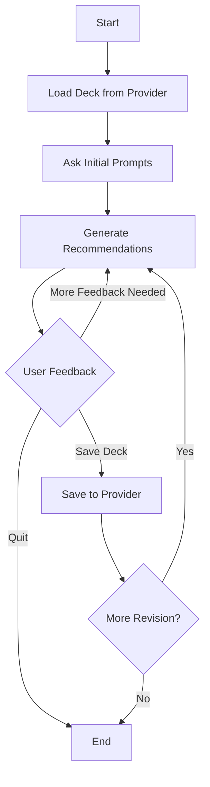

# mtg-collection-tools
Collection of Magic The Gathering automation tools

TODO: I was in the middle of converting old node style into tools. I still need to:
- port the majority of the tools
- make sure the graph is being streamed as I expect
- modify the prompt to fit the new tools
- split the prompt into general guidelines that inform all deckbuilding rules and mode-specific guidelines

eeeh, react agent isn't working all that well. Maybe go back to the node approach, even though it is painful?

I still have node stuff on a different branch. See here for a possible guide: https://langchain-ai.github.io/langgraph/how-tos/react-agent-from-scratch/#define-the-graph

## Deckbuilding Agent Workflow
Adapted from: https://chatgpt.com/share/68446cf2-9570-8004-b10d-b0879d84cc16

The diagram above shows the workflow for the deckbuilding agent when working with an existing deck. The process follows these steps:

1. **Load Deck**: Fetches the deck from a provider (e.g., Archidekt)
2. **Initial Prompts**: Gathers user preferences and requirements
3. **Generate Recommendations**: LLM analyzes the deck and suggests improvements
4. **User Feedback Loop**: 
   - If more feedback needed: Returns to recommendations
   - If quit requested: Ends process
   - If save requested: Proceeds to save
5. **Save & Final Decision**:
   - Saves deck to provider
   - User can request more revisions or end process

### Communication

- Non-llm nodes interact directly with the state
- Llm nodes call a tool for making a suggestion
- Original Deck Kept in memory, with suggestions as a simple add / cut structure

### Tools
- scryfall search: search for cards in syntax pattern
- edhrec_rank: get edhrec rank and supporting information
- collection_has: check if card exists in collection
- collection search: search for cards in collection in syntax pattern

